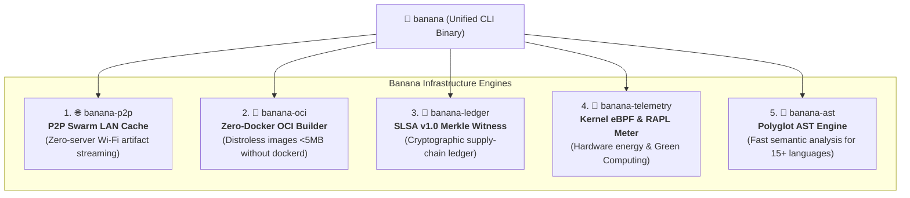

# 🍌 Banana: Universal Infrastructure, P2P Swarm & Distribution Engine

> 🌐 **Language Navigation / 多语言文档 / 多語言文檔 / ドキュメント言語:**
> [English](README.md) | [Tiếng Việt](docs/vi/README.md) | [日本語](docs/ja/README.md) | [简体中文](docs/zh-hans/README.md) | [繁體中文](docs/zh-hant/README.md)

[](https://github.com/requla11/banana/actions/workflows/ci.yml)
[](LICENSE)
[](Cargo.toml)
[](Cargo.toml)

---

## 📖 Overview

**Banana** is the companion distribution, networking, and supply-chain infrastructure suite for modern multi-toolchain build ecosystems (such as [Fish](https://github.com/requla11/fish) and [Apple](https://github.com/requla11/apple)).

Designed as a high-performance, single-binary Rust engine, Banana encapsulates 5 critical infrastructure capabilities that operate independently without centralized servers or heavyweight daemons.

---

## 🚀 Core Capabilities



1. 🌐 **P2P Swarm LAN Cache Mesh (`banana-p2p`)**:
   - Zero-configuration peer discovery via mDNS and high-throughput chunked BLAKE3 artifact sharing across local Wi-Fi and LAN networks ($0 cloud server costs).
2. 🐳 **Zero-Docker OCI Container Builder (`banana-oci`)**:
   - Compiles rootfs directories directly into OCI v1.0 compliant container tarballs without requiring Docker Desktop, `dockerd`, or root permissions.
3. 🐙 **SLSA v1.0 Cryptographic Ledger (`banana-ledger`)**:
   - Cryptographic witness node that validates In-Toto provenance, records artifact hashes into a verifiable Merkle Tree, and signs root digests with Ed25519.
4. 🦞 **Hardware Green Energy & Telemetry Profiler (`banana-telemetry`)**:
   - Measures exact energy consumption in Joules via CPU RAPL hardware counters and estimates CO2 carbon footprint.
5. 🪸 **Polyglot Semantic AST Engine (`banana-ast`)**:
   - High-speed static analysis and dependency graph generator supporting Rust, Python, TypeScript, JavaScript, Go, and C++.

---

## 🛠️ Installation & Quick Start

```bash
# Build from source
cargo install --path .

# Run P2P Swarm Node
banana p2p --addr 127.0.0.1:8080 --node-id node-alpha

# Build an OCI Container without Docker
banana oci --rootfs ./dist --output ./distroless-app.tar --working-dir /app

# Append build artifact to cryptographic ledger
banana ledger --artifact my-app --hash blake3:9a12bc...

# Measure execution energy & carbon impact
banana telemetry --tdp-watts 65.0 --grid-intensity 300.0

# Extract semantic symbols from source code
banana ast --file ./src/main.rs
```

---

## 📜 License

Licensed under either of [Apache License, Version 2.0](LICENSE-APACHE) or [MIT License](LICENSE-MIT) at your option.
