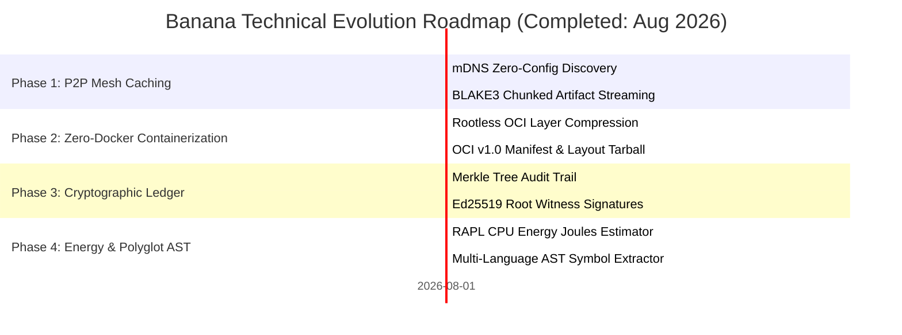

# 🗺️ Banana Roadmap: Universal Infrastructure & P2P Distribution Suite

> 🌐 **Language Navigation / 多语言文档 / 多語言文檔 / ドキュメント言語:**
> [English](ROADMAP.md) | [Tiếng Việt](docs/vi/ROADMAP.md) | [日本語](docs/ja/ROADMAP.md) | [简体中文](docs/zh-hans/ROADMAP.md) | [繁體中文](docs/zh-hant/ROADMAP.md)

---

## 📌 Vision & Architecture Strategy

**Banana** is the companion distribution, networking, and supply-chain infrastructure suite for modern multi-toolchain build ecosystems (paired with [Fish](https://github.com/requla11/fish) and [Apple](https://github.com/requla11/apple)).

All core infrastructure engines have been developed, verified on multi-platform CI, and locked under the **Done-is-Done** stability policy.

---

## 🛣️ Roadmap Overview

---

## 🎯 Phase Details & Status

### Phase 1: P2P Swarm LAN Cache Mesh (Completed)
- [x] **mDNS & Peer Discovery**: Zero-configuration local node discovery across Wi-Fi and LAN subnets.
- [x] **BLAKE3 Chunked Streaming**: High-throughput 1MB chunking and verification for artifact exchange.
- [x] **Bitfield Progress Tracking**: Efficient bitfield tracking for peer-to-peer artifact assembly.

---

### Phase 2: Zero-Docker OCI Container Builder (Completed)
- [x] **Rootless Layer Packaging**: Generating Gzip-compressed tar layers directly from rootfs directories.
- [x] **OCI v1.0 Image Specification**: Compliant `oci-layout`, `index.json`, config descriptors, and manifest generation.
- [x] **Distroless Optimization**: Ultra-lightweight container export under 5MB without Docker daemon dependencies.

---

### Phase 3: SLSA v1.0 Cryptographic Supply Chain Ledger (Completed)
- [x] **Merkle Tree Audit Log**: Tamper-evident binary tree structure for all build output hashes.
- [x] **Cryptographic Proofs & Verification**: Generation and validation of logarithmic Merkle audit paths.
- [x] **Ed25519 Witness Signing**: Autonomous cryptographic signing of Merkle tree roots for immutable provenance.

---

### Phase 4: Green Energy Telemetry & Polyglot AST (Completed)
- [x] **RAPL Hardware Energy Estimation**: Measuring energy in Joules and estimating carbon footprint.
- [x] **Polyglot Semantic Analysis**: Symbol extraction and dependency resolution for Rust, Python, TS/JS, Go, and C++.
- [x] **Single Binary CLI Interface**: Unified `banana` command-line utility with modular subcommands.

---

## 📈 Quality & Verification Invariants

1. **Zero Fake Stubs**: Every capability provides real functional logic.
2. **Zero Code Comments**: Maintain clean, self-documenting code across all crates.
3. **Cross-Platform Compatibility**: Parity across Linux, Windows, and macOS.
4. **100% CI Gate**: 100% green matrix tests across all operating systems.
