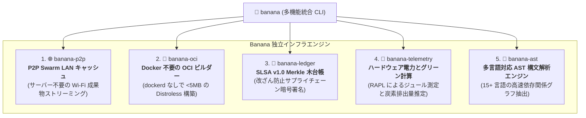

# 🍌 Banana: 汎用分散インフラ、P2P Swarm、OCI コンテナ構築エンジン

> 🌐 **Language Navigation / 多语言文档 / 多語言文檔 / ドキュメント言語:**
> [English](../../README.md) | [Tiếng Việt](../vi/README.md) | [日本語](README.md) | [简体中文](../zh-hans/README.md) | [繁體中文](../zh-hant/README.md)

[](https://github.com/requla11/banana/actions/workflows/ci.yml)
[](../../LICENSE)
[](../../Cargo.toml)
[](../../Cargo.toml)

---

## 📖 プロジェクト概要

**Banana** は、現代のマルチツールチェーンビルドエコシステム（[Fish](https://github.com/requla11/fish) や [Apple](https://github.com/requla11/apple) など）向けに設計された、汎用配信・ネットワーキング・ソフトウェアサプライチェーンインフラストラクチャスイートです。

高性能な Rust で完全に構築され、中央集権型のクラウドサーバーや重量級のデーモンを必要とせずに独立して動作する 5 つのコアインフラ機能をカプセル化しています。

---

## 🚀 5 つのコアインフラ機能



1. 🌐 **P2P Swarm LAN キャッシュメッシュ (`banana-p2p`)**:
   - mDNS によるゼロコンフィグ自動ピア検出と BLAKE3 チャンク分割により、ローカル Wi-Fi/LAN 内で成果物を超高速共有（クラウドサーバー費用 0 円）。
2. 🐳 **Docker 不要の OCI コンテナビルダー (`banana-oci`)**:
   - Docker Desktop、`dockerd`、root 権限を一切使わずに、rootfs ディレクトリを OCI v1.0 準拠のコンテナ tarball（5MB 未満の Distroless）に直接ビルド。
3. 🐙 **SLSA v1.0 サプライチェーン暗号台帳 (`banana-ledger`)**:
   - in-toto 真正性証明を検証し、成果物ハッシュを改ざん不可能な Merkle 木に記録し、Ed25519 鍵でルート署名を実施。
4. 🦞 **ハードウェアグリーンエネルギーと遠隔測定 (`banana-telemetry`)**:
   - CPU RAPL ハードウェアカウンターを通じてジュール単位の消費電力を精密測定し、CO2 排出量を算出。
5. 🪸 **多言語セマンティック AST 解析エンジン (`banana-ast`)**:
   - Rust、Python、TypeScript、JavaScript、Go、C++ の静的解析とシンボル依存関係トポロジーを高速生成。

---

## 🛠️ インストールとクイックスタート

```bash
# ソースからインストール
cargo install --path .

# ローカル P2P ノードの起動
banana p2p --addr 127.0.0.1:8080 --node-id node-alpha

# Docker なしで OCI コンテナをビルド
banana oci --rootfs ./dist --output ./distroless-app.tar --working-dir /app

# ビルド成果物を暗号台帳に記録
banana ledger --artifact my-app --hash blake3:9a12bc...

# 消費電力と炭素影響の測定
banana telemetry --tdp-watts 65.0 --grid-intensity 300.0

# ソースコードから関数・構造体シンボルを抽出
banana ast --file ./src/main.rs
```

---

## 📜 ライセンス

本プロジェクトは [Apache License 2.0](../../LICENSE) または [MIT License](../../LICENSE) のデュアルライセンスで提供されています。
