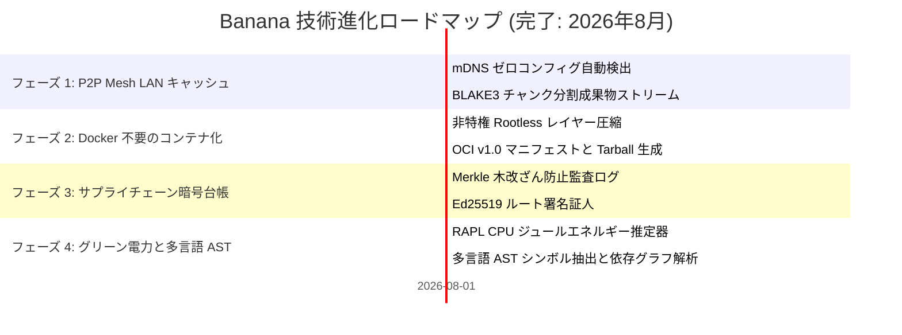

# 🗺️ Banana ロードマップ (ROADMAP): 汎用分散インフラと P2P 配信スイート

> 🌐 **Language Navigation / 多语言文档 / 多語言文檔 / ドキュメント言語:**
> [English](../../ROADMAP.md) | [Tiếng Việt](../vi/ROADMAP.md) | [日本語](ROADMAP.md) | [简体中文](../zh-hans/ROADMAP.md) | [繁體中文](../zh-hant/ROADMAP.md)

---

## 📌 ビジョンとアーキテクチャ戦略

**Banana** は、現代のマルチツールチェーンビルドエコシステム（[Fish](https://github.com/requla11/fish) や [Apple](https://github.com/requla11/apple) と連携）向けに設計された、汎用配信・ネットワーキング・ソフトウェアサプライチェーンインフラストラクチャスイートです。

すべてのコアインフラストラクチャエンジンは開発が完了し、マルチプラットフォーム CI で検証され、**Done-is-Done** 安定性ポリシーの下で正式に固定されました。

---

## 🛣️ ロードマップ概要

---

## 🎯 各フェーズの詳細とステータス

### フェーズ 1: P2P Swarm LAN キャッシュメッシュ (完了)
- [x] **mDNS と自動ピア検出**: 構内 Wi-Fi および LAN サブネットでのゼロコンフィグ検出。
- [x] **BLAKE3 チャンク化ストリーミング**: 1MB チャンク分割による高速転送と完全性検証。
- [x] **ビットフィールド進捗管理**: ピア間での成果物組み立て進捗の追跡。

---

### フェーズ 2: Docker 不要の OCI コンテナビルダー (完了)
- [x] **Rootless レイヤーパッケージング**: rootfs ディレクトリから直接 Gzip レイヤーを生成。
- [x] **OCI v1.0 準拠イメージ仕様**: `oci-layout`、`index.json`、設定ディスクリプタを完全準拠で出力。
- [x] **Distroless 最適化**: dockerd なしで 5MB 未満の超軽量コンテナを作成。

---

### フェーズ 3: SLSA v1.0 サプライチェーン暗号台帳 (完了)
- [x] **Merkle 木監査ログ**: ビルド成果物ハッシュをバイナリツリーに不変記録。
- [x] **暗号証明と検証**: 対数計算量での Merkle 監査パス生成と検証。
- [x] **Ed25519 証人署名**: ルートハッシュへの自動署名による完全性の担保。

---

### フェーズ 4: グリーンエネルギー測定と多言語 AST (完了)
- [x] **RAPL ハードウェア電力測定**: ジュール単位の消費電力および CO2 排出量の精密推定。
- [x] **多言語セマンティック構文解析**: Rust、Python、TS/JS、Go、C++ のシンボル抽出。
- [x] **単一バイナリ CLI**: モジュール化されたサブコマンドを統合した `banana` コマンド。

---

## 📈 品質と検証の不変条件

1. **偽装スタブの完全排除 (Zero Fake Stubs)**: 各モジュールが本物のロジックを提供。
2. **コード内コメントの完全排除 (Zero Code Comments)**: 明瞭で自己文書化されたコードベースを維持。
3. **クロスプラットフォーム互換性**: Linux、Windows、macOS で同等の機能を提供。
4. **100% CI ゲート通過**: すべての OS マトリックスでテストが完全成功。
