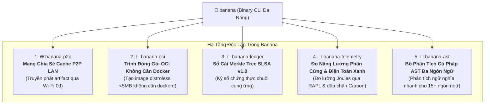

# 🍌 Banana: Bộ Công Cụ Hạ Tầng Phân Tán, Mạng P2P Swarm & Đóng Gói OCI

> 🌐 **Language Navigation / 多语言文档 / 多語言文檔 / ドキュメント言語:**
> [English](../../README.md) | [Tiếng Việt](README.md) | [日本語](../ja/README.md) | [简体中文](../zh-hans/README.md) | [繁體中文](../zh-hant/README.md)

[](https://github.com/requla11/banana/actions/workflows/ci.yml)
[](../../LICENSE)
[](../../Cargo.toml)
[](../../Cargo.toml)

---

## 📖 Giới Thiệu Tổng Quan

**Banana** là bộ công cụ hạ tầng mạng, phân phối và bảo mật chuỗi cung ứng độc lập được thiết kế đồng hành cùng hệ sinh thái build đa ngôn ngữ (như [Fish](https://github.com/requla11/fish) và [Apple](https://github.com/requla11/apple)).

Được viết hoàn toàn bằng Rust với hiệu năng tối đa, Banana tích hợp sẵn 5 năng lực hạ tầng cốt lõi hoạt động độc lập mà không cần cấu hình máy chủ đám mây hay daemon chạy ngầm cồng kềnh.

---

## 🚀 5 Năng Lực Hạ Tầng Cốt Lõi



1. 🌐 **Mạng Chia Sẻ Cache P2P LAN (`banana-p2p`)**:
   - Tự động dò tìm máy cùng mạng Wi-Fi/LAN qua mDNS và truyền phát artifact dạng khối băm BLAKE3 mà **không tốn 1 đồng chi phí thuê Cloud Server**.
2. 🐳 **Trình Đóng Gói OCI Không Cần Docker (`banana-oci`)**:
   - Biên dịch trực tiếp thư mục rootfs thành file tar chuẩn OCI v1.0 (Distroless siêu nhẹ dưới 5MB) mà không cần cài đặt Docker Desktop, `dockerd` hay quyền root.
3. 🐙 **Sổ Cái Bảo Mật Chuỗi Cung Ứng SLSA v1.0 (`banana-ledger`)**:
   - Nhân chứng mật mã học xác thực chứng thư in-toto, ghi nhận hash artifact vào cây Merkle Tree chống giả mạo và ký số khóa Ed25519.
4. 🦞 **Đo Lường Năng Lượng & Điện Toán Xanh (`banana-telemetry`)**:
   - Đo lường chính xác mức tiêu thụ điện năng (Joules) qua bộ đếm phần cứng CPU RAPL và tính toán lượng khí thải CO2.
5. 🪸 **Bộ Phân Tích Cú Pháp AST Đa Ngôn Ngữ (`banana-ast`)**:
   - Trình phân tích tĩnh siêu tốc trích xuất symbol và đồ thị phụ thuộc cho Rust, Python, TypeScript, JavaScript, Go, C++.

---

## 🛠️ Cài Đặt & Hướng Dẫn Sử Dụng Nhanh

```bash
# Cài đặt từ mã nguồn
cargo install --path .

# Khởi chạy node P2P Swarm nội bộ
banana p2p --addr 127.0.0.1:8080 --node-id node-alpha

# Đóng gói ứng dụng thành OCI Container không cần Docker
banana oci --rootfs ./dist --output ./distroless-app.tar --working-dir /app

# Ghi nhận sản phẩm build vào sổ cái an ninh
banana ledger --artifact my-app --hash blake3:9a12bc...

# Đo lường năng lượng tiêu thụ & phát thải carbon
banana telemetry --tdp-watts 65.0 --grid-intensity 300.0

# Trích xuất cấu trúc hàm/struct từ mã nguồn
banana ast --file ./src/main.rs
```

---

## 📜 Giấy Phép Bản Quyền

Dự án được phân phối dưới giấy phép kép [Apache License, Version 2.0](../../LICENSE) hoặc [MIT License](../../LICENSE).
