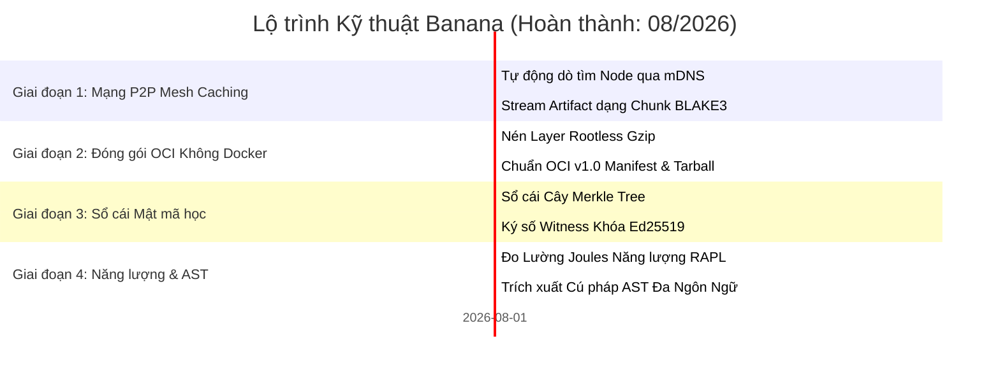

# 🗺️ Lộ Trình Phát Triển Banana (ROADMAP): Hạ Tầng Phân Tán & Đóng Gói OCI

> 🌐 **Language Navigation / 多语言文档 / 多語言文檔 / ドキュメント言語:**
> [English](../../ROADMAP.md) | [Tiếng Việt](ROADMAP.md) | [日本語](../ja/ROADMAP.md) | [简体中文](../zh-hans/ROADMAP.md) | [繁體中文](../zh-hant/ROADMAP.md)

---

## 📌 Tầm Nhìn & Chiến Lược Kiến Trúc

**Banana** là bộ công cụ hạ tầng mạng, phân phối và bảo mật chuỗi cung ứng độc lập được thiết kế đồng hành cùng hệ sinh thái build đa ngôn ngữ (kết hợp cùng [Fish](https://github.com/requla11/fish) và [Apple](https://github.com/requla11/apple)).

Toàn bộ các cột mốc kiến trúc hạ tầng cốt lõi đã được hoàn thành 100%, kiểm thử tự động xanh trên CI đa nền tảng, và khóa theo chính sách ổn định **Done-is-Done**.

---

## 🛣️ Tổng Quan Lộ Trình

---

## 🎯 Chi Tiết Từng Giai Đoạn & Trạng Thái

### Giai đoạn 1: Mạng Chia Sẻ Cache P2P LAN (Đã hoàn thành)
- [x] **Tự động dò tìm Node qua mDNS**: Tự động phát hiện các máy tính cùng mạng Wi-Fi/LAN không cần cấu hình.
- [x] **Truyền phát Chunk băm BLAKE3**: Chia nhỏ artifact thành các khối 1MB để tải song song tốc độ cao.
- [x] **Theo dõi tiến độ Bitfield**: Quản lý bitfield chính xác để ráp nối các khối artifact từ nhiều peer.

---

### Giai đoạn 2: Trình Đóng Gói OCI Không Cần Docker (Đã hoàn thành)
- [x] **Đóng gói Layer Rootless**: Nén trực tiếp thư mục rootfs thành các layer Gzip chuẩn OCI.
- [x] **Đặc tả Hình ảnh OCI v1.0**: Tạo file `oci-layout`, `index.json`, config descriptor và manifest hoàn chỉnh.
- [x] **Tối ưu Distroless**: Xuất container siêu nhẹ dưới 5MB mà không cần Docker Desktop hay daemon `dockerd`.

---

### Giai đoạn 3: Sổ Cái Bảo Mật Chuỗi Cung Ứng SLSA v1.0 (Đã hoàn thành)
- [x] **Nhật ký Cây Merkle Tree**: Cấu trúc cây nhị phân lưu trữ toàn bộ mã băm đầu ra của các bản build.
- [x] **Bằng chứng Mật mã học & Xác minh**: Tạo và xác thực đường dẫn kiểm toán Merkle theo thời gian logarithmic.
- [x] **Ký số Nhân chứng Ed25519**: Ký số mật mã học tự động cho Merkle root đảm bảo nguồn gốc bất biến.

---

### Giai đoạn 4: Đo Lường Năng Lượng & AST Đa Ngôn Ngữ (Đã hoàn thành)
- [x] **Đo lường Năng lượng Phần cứng RAPL**: Tính toán năng lượng tiêu thụ (Joules) và ước tính dấu chân carbon CO2.
- [x] **Phân tích Cú pháp Ngữ nghĩa Đa Ngôn ngữ**: Trích xuất symbol cho Rust, Python, TS/JS, Go, C++.
- [x] **Giao diện CLI Đơn nhất**: Binary `banana` duy nhất với các lệnh phân nhánh rõ ràng.

---

## 📈 Nguyên Tắc Bất Biến Về Chất Lượng

1. **Không Dùng Mã Giả (Zero Fake Stubs)**: Mọi tính năng cung cấp logic thực thi thực tế.
2. **Không Viết Comment Vào Code**: Giữ mã nguồn ngắn gọn, tự giải thích.
3. **Tương Thích Đa Nền Tảng**: Đảm bảo hoạt động đồng đều trên Linux, Windows và macOS.
4. **100% Vượt Qua CI Matrix**: Mọi thay đổi bắt buộc phải vượt qua toàn bộ bài kiểm thử.
