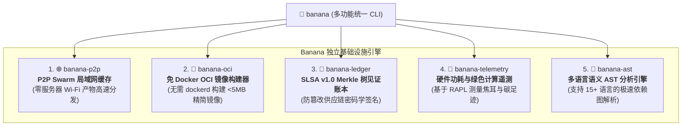

# 🍌 Banana: 通用分布式基础设施、P2P Swarm 与 OCI 容器构建引擎

> 🌐 **Language Navigation / 多语言文档 / 多語言文檔 / ドキュメント言語:**
> [English](../../README.md) | [Tiếng Việt](../vi/README.md) | [日本語](../ja/README.md) | [简体中文](README.md) | [繁體中文](../zh-hant/README.md)

[](https://github.com/requla11/banana/actions/workflows/ci.yml)
[](../../LICENSE)
[](../../Cargo.toml)
[](../../Cargo.toml)

---

## 📖 项目概述

**Banana** 是专为现代多工具链构建生态系统（如 [Fish](https://github.com/requla11/fish) 和 [Apple](https://github.com/requla11/apple)）设计的通用分发、网络与软件供应链基础设施套件。

Banana 完全采用高性能 Rust 编写，封装了 5 项核心基础设施能力，无需中心化云端服务器或繁重的系统守护进程即可独立运行。

---

## 🚀 5 大核心基础设施能力



1. 🌐 **P2P Swarm 局域网缓存网络 (`banana-p2p`)**:
   - 基于 mDNS 的零配置节点自动发现，通过 BLAKE3 分块在局域网内高速共享构建产物（0 云端服务器费用）。
2. 🐳 **免 Docker OCI 容器构建器 (`banana-oci`)**:
   - 直接将 rootfs 目录编译为符合 OCI v1.0 规范的容器镜像 tarball，无需安装 Docker Desktop、`dockerd` 或 root 特权。
3. 🐙 **SLSA v1.0 密码学溯源账本 (`banana-ledger`)**:
   - 验证 in-toto 溯源凭证，将制品哈希记录至防篡改 Merkle 树，并使用 Ed25519 密钥对根哈希进行数字签名。
4. 🦞 **硬件绿色能耗与遥测分析器 (`banana-telemetry`)**:
   - 通过 CPU RAPL 硬件计数器精确测量焦耳 (Joules) 级能量消耗，并预估碳排放影响。
5. 🪸 **多语言语义 AST 分析引擎 (`banana-ast`)**:
   - 支持 Rust、Python、TypeScript、JavaScript、Go、C++ 的极速静态分析与符号依赖拓扑生成。

---

## 🛠️ 安装与快速上手

```bash
# 从源码编译安装
cargo install --path .

# 启动局域网 P2P 节点
banana p2p --addr 127.0.0.1:8080 --node-id node-alpha

# 构建 OCI 容器镜像 (无需 Docker)
banana oci --rootfs ./dist --output ./distroless-app.tar --working-dir /app

# 将构建产物记录至密码学安全账本
banana ledger --artifact my-app --hash blake3:9a12bc...

# 测量能耗与碳足迹
banana telemetry --tdp-watts 65.0 --grid-intensity 300.0

# 提取源码中的函数与结构体符号
banana ast --file ./src/main.rs
```

---

## 📜 开源协议
本项目采用 [MIT License](../../LICENSE) 许可协议。

