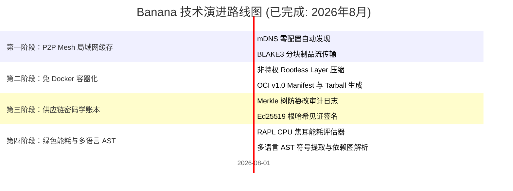

# 🗺️ Banana 路线图 (ROADMAP): 通用基础设施与 P2P 分发套件

> 🌐 **Language Navigation / 多语言文档 / 多語言文檔 / ドキュメント言語:**
> [English](../../ROADMAP.md) | [Tiếng Việt](../vi/ROADMAP.md) | [日本語](../ja/ROADMAP.md) | [简体中文](ROADMAP.md) | [繁體中文](../zh-hant/ROADMAP.md)

---

## 📌 愿景与架构战略

**Banana** 是专为现代多工具链构建生态系统（与 [Fish](https://github.com/requla11/fish) 和 [Apple](https://github.com/requla11/apple) 协同工作）设计的通用分发、网络与软件供应链基础设施套件。

所有核心基础设施引擎均已开发完毕，通过了多平台自动化 CI 验证，正式遵循 **Done-is-Done** 冻结与稳定策略。

---

## 🛣️ 路线图概览

---

## 🎯 各阶段详细内容与状态

### 第一阶段：P2P Swarm 局域网缓存网络 (已完成)
- [x] **mDNS 与节点自动发现**: 局域网与 Wi-Fi 子网内零配置节点发现。
- [x] **BLAKE3 分块流式传输**: 1MB 分块高通量传输与哈希校验。
- [x] **Bitfield 位图进度追踪**: 高效追踪点对点制品组装进度。

---

### 第二阶段：免 Docker OCI 容器构建器 (已完成)
- [x] **Rootless 图层打包**: 直接从 rootfs 打包 Gzip 压缩层。
- [x] **OCI v1.0 镜像规范兼容**: 生成合规的 `oci-layout`、`index.json` 及配置描述符。
- [x] **Distroless 极简优化**: 无需 dockerd 构建 5MB 以下超轻量镜像。

---

### 第三阶段：SLSA v1.0 密码学供应链账本 (已完成)
- [x] **Merkle 树审计日志**: 二叉哈希树记录所有构建制品指纹。
- [x] **密码学证明与验证**: 对数复杂度 Merkle 审计路径生成与验证。
- [x] **Ed25519 见证人签名**: 自动签署 Merkle 根哈希确保不可篡改性。

---

### 第四阶段：绿色能耗遥测与多语言 AST (已完成)
- [x] **RAPL 硬件能耗测量**: 精确评估焦耳能耗与碳足迹影响。
- [x] **多语言语义解析**: 支持 Rust、Python、TS/JS、Go、C++ 符号提取。
- [x] **单一二进制 CLI 接口**: 模块化子命令整合至单一 `banana` 二进制中。

---

## 📈 质量与验证原则

1. **零伪桩代码 (Zero Fake Stubs)**: 每个模块均提供真实逻辑。
2. **代码零注释 (Zero Code Comments)**: 保持代码整洁规范。
3. **跨平台兼容性**: Linux、Windows 与 macOS 保持完全对等。
4. **100% CI 门禁**: 必须通过所有操作系统自动化测试。
