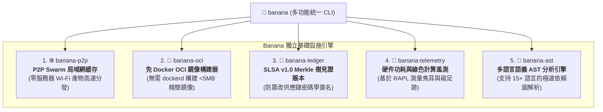

# 🍌 Banana: 通用分佈式基礎設施、P2P Swarm 與 OCI 容器構建引擎

> 🌐 **Language Navigation / 多语言文档 / 多語言文檔 / ドキュメント言語:**
> [English](../../README.md) | [Tiếng Việt](../vi/README.md) | [日本語](../ja/README.md) | [简体中文](../zh-hans/README.md) | [繁體中文](README.md)

[](https://github.com/requla11/banana/actions/workflows/ci.yml)
[](../../LICENSE)
[](../../Cargo.toml)
[](../../Cargo.toml)

---

## 📖 項目概述

**Banana** 是專為現代多工具鏈構建生態系統（如 [Fish](https://github.com/requla11/fish) 和 [Apple](https://github.com/requla11/apple)）設計的通用分發、網絡與軟件供應鏈基礎設施套件。

Banana 完全採用高性能 Rust 編寫，封裝了 5 項核心基礎設施能力，無需中心化雲端服務器或繁重的系統守護進程即可獨立運行。

---

## 🚀 5 大核心基礎設施能力



1. 🌐 **P2P Swarm 局域網緩存網絡 (`banana-p2p`)**:
   - 基於 mDNS 的零配置節點自動發現，通過 BLAKE3 分塊在局域網內高速共享構建產物（0 雲端服務器費用）。
2. 🐳 **免 Docker OCI 容器構建器 (`banana-oci`)**:
   - 直接將 rootfs 目錄編譯為符合 OCI v1.0 規範的容器鏡像 tarball，無需安裝 Docker Desktop、`dockerd` 或 root 特權。
3. 🐙 **SLSA v1.0 密碼學溯源賬本 (`banana-ledger`)**:
   - 驗證 in-toto 溯源憑證，將產物哈希記錄至防篡改 Merkle 樹，並使用 Ed25519 密鑰對根哈希進行數字簽名。
4. 🦞 **硬件綠色能耗與遙測分析器 (`banana-telemetry`)**:
   - 通過 CPU RAPL 硬件計數器精確測量焦耳 (Joules) 級能量消耗，並預估碳排放影響。
5. 🪸 **多語言語義 AST 分析引擎 (`banana-ast`)**:
   - 支持 Rust、Python、TypeScript、JavaScript、Go、C++ 的極速靜態分析與符號依賴拓撲生成。

---

## 🛠️ 安裝與快速上手

```bash
# 從源碼編譯安裝
cargo install --path .

# 啟動局域網 P2P 節點
banana p2p --addr 127.0.0.1:8080 --node-id node-alpha

# 構建 OCI 容器鏡像 (無需 Docker)
banana oci --rootfs ./dist --output ./distroless-app.tar --working-dir /app

# 將構建產物記錄至密碼學安全賬本
banana ledger --artifact my-app --hash blake3:9a12bc...

# 測量能耗與碳足跡
banana telemetry --tdp-watts 65.0 --grid-intensity 300.0

# 提取源碼中的函數與結構體符號
banana ast --file ./src/main.rs
```

---

## 📜 開源協議

本項目採用 [Apache License 2.0](../../LICENSE) 或 [MIT License](../../LICENSE) 雙重許可。
