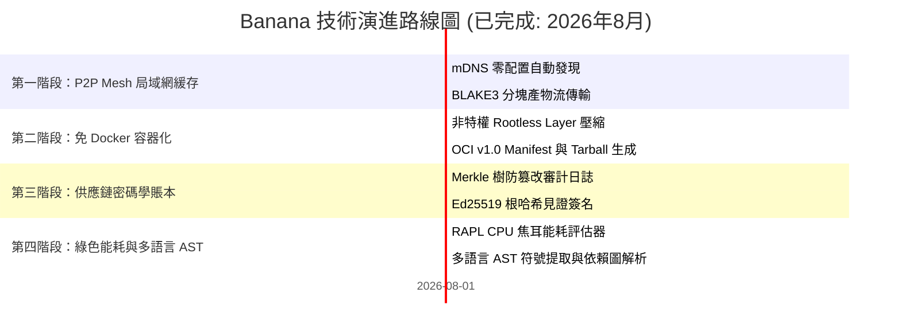

# 🗺️ Banana 路線圖 (ROADMAP): 通用基礎設施與 P2P 分發套件

> 🌐 **Language Navigation / 多语言文档 / 多語言文檔 / ドキュメント言語:**
> [English](../../ROADMAP.md) | [Tiếng Việt](../vi/ROADMAP.md) | [日本語](../ja/ROADMAP.md) | [简体中文](../zh-hans/ROADMAP.md) | [繁體中文](ROADMAP.md)

---

## 📌 願景與架構戰略

**Banana** 是專為現代多工具鏈構建生態系統（與 [Fish](https://github.com/requla11/fish) 和 [Apple](https://github.com/requla11/apple) 協同工作）設計的通用分發、網絡與軟件供應鏈基礎設施套件。

所有核心基礎設施引擎均已開發完畢，通過了多平台自動化 CI 驗證，正式遵循 **Done-is-Done** 凍結與穩定策略。

---

## 🛣️ 路線圖概覽

---

## 🎯 各階段詳細內容與狀態

### 第一階段：P2P Swarm 局域網緩存網絡 (已完成)
- [x] **mDNS 與節點自動發現**: 局域網與 Wi-Fi 子網內零配置節點發現。
- [x] **BLAKE3 分塊流式傳輸**: 1MB 分塊高通量傳輸與哈希校驗。
- [x] **Bitfield 位圖進度追蹤**: 高效追蹤點對點產物組裝進度。

---

### 第二階段：免 Docker OCI 容器構建器 (已完成)
- [x] **Rootless 圖層打包**: 直接從 rootfs 打包 Gzip 壓縮層。
- [x] **OCI v1.0 鏡像規範兼容**: 生成合規的 `oci-layout`、`index.json` 及配置描述符。
- [x] **Distroless 極簡優化**: 無需 dockerd 構建 5MB 以下超輕量鏡像。

---

### 第三階段：SLSA v1.0 密碼學供應鏈賬本 (已完成)
- [x] **Merkle 樹審計日誌**: 二叉哈希樹記錄所有構建產物指紋。
- [x] **密碼學證明與驗證**: 對數複雜度 Merkle 審計路徑生成與驗證。
- [x] **Ed25519 見證人簽名**: 自動簽署 Merkle 根哈希確保不可篡改性。

---

### 第四階段：綠色能耗遙測與多語言 AST (已完成)
- [x] **RAPL 硬件能耗測量**: 精確評估焦耳能耗與碳足跡影響。
- [x] **多語言語義解析**: 支持 Rust、Python、TS/JS、Go、C++ 符號提取。
- [x] **單一二進制 CLI 接口**: 模塊化子命令整合至單一 `banana` 二進制中。

---

## 📈 質量與驗證原則

1. **零偽樁代碼 (Zero Fake Stubs)**: 每個模塊均提供真實邏輯。
2. **代碼零註釋 (Zero Code Comments)**: 保持代碼整潔規範。
3. **跨平台兼容性**: Linux、Windows 與 macOS 保持完全對等。
4. **100% CI 門禁**: 必須通過所有操作系統自動化測試。
